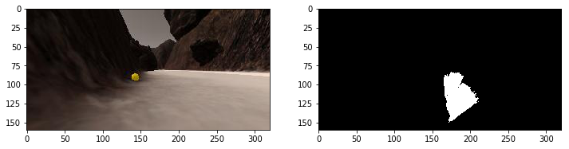
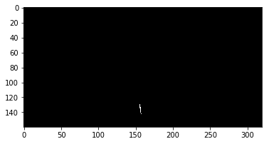
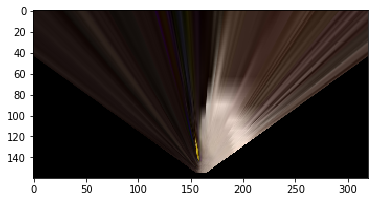

# Udacity Robotics Nanodegree - Rover Search and Sample Return Project
 
## Notebook Analysis
 
### Rock sample and obstacle detection
 
#### Obstacle
 
The obstacle detection was mostly finding the inverse of navigable pixels. I
used the transformed image to get navigable pixels by applying a color threshold
(R >= 160, G >= 160, B >= 160) as shown below:
 
```
# Identify pixels above the threshold
# Threshold of RGB > 160 does a nice job of identifying ground pixels only
def color_thresh(img, rgb_thresh=(160, 160, 160)):
    # Create an array of zeros same xy size as img, but single channel
    color_select = np.zeros_like(img[:,:,0])
    # Require that each pixel be above all three threshold values in RGB
    # above_thresh will now contain a boolean array with "True"
    # where threshold was met
    above_thresh = (img[:,:,0] > rgb_thresh[0]) \
                & (img[:,:,1] > rgb_thresh[1]) \
                & (img[:,:,2] > rgb_thresh[2])
    # Index the array of zeros with the boolean array and set to 1
    color_select[above_thresh] = 1
    # Return the binary image
    return color_select
 
threshed = color_thresh(warped)
```
 

 
Then I applied a Binary ones complement to invert the image to find the
obstacles.
 
```
obsticle_threshed = ~threshed
```
 
I then transformed them to world coordinates to be added to the World map.
 
#### Rock sample
 
For the rock sample detection, I wrote the following function that applies a
color threshold, with the color values out of a given rage being blacked out.
 
```
# Identify pixels in range.
# Threshold of 135 < R < 200, 100 < G < 180 and -1 < B < 40 does a nice job of
# identifying rock samples.
def color_range(img, rgb_thresh_bottom=(135, 100, -1), \
                rgb_thresh_top=(200, 180, 40)):
    # Create an array of zeros same xy size as img, but single channel
    color_select = np.zeros_like(img[:,:,0])
    # Requires that each pixel be in between the range for all three threshold
    # values of RGB.
    # in_range will now contain a boolean array with 'True' where the values are
    # in range given.
    in_range = (img[:,:,0] > rgb_thresh_bottom[0]) & (img[:,:,0] < rgb_thresh_top[0]) \
            & (img[:,:,1] > rgb_thresh_bottom[1]) & (img[:,:,1] < rgb_thresh_top[1]) \
            & (img[:,:,2] > rgb_thresh_bottom[2]) & (img[:,:,2] < rgb_thresh_top[2])
    
    # Index the arry of zeros with the boolean array and set to 1
    color_select[in_range] = 1
    # Return the binary image
    return color_select
```
 

 
### Mapping the world
 
I followed the steps provided in the `process_image()` function to generate the
world map. First, I created a source and destination coordinate values needed for
applying a perspective transform on the camera image.
 
```
bottom_offset = 6
source = np.float32([[14, 140], [301 ,140],[200, 96], [118, 96]])
destination = np.float32([[img.shape[1]/2 - dst_size, img.shape[0] - bottom_offset],
              [img.shape[1]/2 + dst_size, img.shape[0] - bottom_offset],
              [img.shape[1]/2 + dst_size, img.shape[0] - 2*dst_size - bottom_offset], 
              [img.shape[1]/2 - dst_size, img.shape[0] - 2*dst_size - bottom_offset],
              ])
```
 
Next, I used the `cv2` library's `perspect_transform()` function to get a
transformed image.
 
```
warped = perspect_transform(img, source, destination)
```
 

 
Then, I used the `color_thresh()` function to obtain the navigable/obstacle
pixels and used the `color_range()` function to obtain the rock sample pixels.
 
```
threshed = color_thresh(warped)
rock_threshed = color_range(warped)
obsticle_threshed = ~threshed
```
 
I then converted the image pixel values to rover-centric coordinates using the
`rover_coords()` function.
 
```
navigable_xpix, navigable_ypix = rover_coords(threshed)
rock_xpix, rock_ypix = rover_coords(rock_threshed)
obsticle_xpix, obsticle_ypix = rover_coords(obsticle_threshed)
```
 
In the warped image, the farther pixels are not very accurate and can be
ignored. I used 50 units as the threshold and got the good pixels as shown
below.
 
```
max_distance = 50
max_rock_distance = 40
 
good_navigable = np.sqrt(navigable_xpix**2 + navigable_ypix**2) < max_distance
good_navigable_x = navigable_xpix[good_navigable]
good_navigable_y = navigable_ypix[good_navigable]
 
good_rock = np.sqrt(rock_xpix**2 + rock_ypix**2) < max_rock_distance
good_rock_x = rock_xpix[good_rock]
good_rock_y = rock_ypix[good_rock]
 
good_obsticle = np.sqrt(obsticle_xpix**2 + obsticle_ypix**2) < max_distance
good_obsticle_x = obsticle_xpix[good_obsticle]
good_obsticle_y = obsticle_ypix[good_obsticle]
```
 
Next I converted the "good" pixels into world coordinates using the
`pix_to_world()` function.
 
```
scale = 2 * dst_size
navigable_xpix_world, navigable_ypix_world = pix_to_world(good_navigable_x,
                                                          good_navigable_y,
                                                          data.xpos[data.count],
                                                          data.ypos[data.count],
                                                          data.yaw[data.count],
                                                          data.worldmap.shape[0],
                                                          scale)
rock_xpix_world, rock_ypix_world = pix_to_world(good_rock_x,
                                                good_rock_y,
                                                data.xpos[data.count],
                                                data.ypos[data.count],
                                                data.yaw[data.count],
                                                data.worldmap.shape[0],
                                                scale)
obsticle_xpix_world, obsticle_ypix_world = pix_to_world(good_obsticle_x,
                                                        good_obsticle_y,
                                                        data.xpos[data.count],
                                                        data.ypos[data.count],
                                                        data.yaw[data.count],
                                                        data.worldmap.shape[0],
                                                        scale)
```
 
Next, I updated the `worldmap` array on the `data` object with these values as
shown below:
 
```
data.worldmap[navigable_ypix_world, navigable_xpix_world, 2] = 255
data.worldmap[rock_ypix_world, rock_xpix_world, 1] = 255
    data.worldmap[navigable_ypix_world, navigable_xpix_world, 0] = 0
data.worldmap[obsticle_ypix_world, obsticle_xpix_world, 0] = 255
```
 
I added the rover vision image to the `output_image`.
 
```
# Add rover vision image.
output_image[-img.shape[0]:, img.shape[1]:, 0] = threshed * 255
output_image[-img.shape[0]:, img.shape[1]:, 1] = rock_threshed * 255
output_image[-img.shape[0]:, img.shape[1]:, 2] = obsticle_threshed * 255
```
 
Finally, I added title text over each of the images in the `output_image`.
 
```
cv2.putText(output_image,"Original Image", (20, 20), 
            cv2.FONT_HERSHEY_COMPLEX, 0.4, (255, 255, 255), 1)
cv2.putText(output_image,"Warped Image", (20 + img.shape[1], 20), 
            cv2.FONT_HERSHEY_COMPLEX, 0.4, (255, 255, 255), 1)
cv2.putText(output_image,"World Map", (20, 20 + img.shape[0]), 
            cv2.FONT_HERSHEY_COMPLEX, 0.4, (255, 255, 255), 1)
cv2.putText(output_image,"Rover Vision", (20 + img.shape[1], 20 + img.shape[0]), 
            cv2.FONT_HERSHEY_COMPLEX, 0.4, (255, 255, 255), 1)
```
 
The [test_mapping.mp4](//github.com/sbagadi/RoboND-Rover-Project/blob/master/output/test_mapping.mp4)
shows a sample of the video generated.
 
## Autonomous navigation and mapping
 
### Perception step
 
The `perception_step()` uses the same concepts as `process_image()` to generate
the world map. In addition to creating the world map, the `perception_step()`
function also does a few other things.
 
The rover images obtained when the rover is on an incline may not be valid,
since our perspective transform source and destination values are based on when
the rover is on flat ground. So to avoid making decision on invalid data, we
will be skipping the frames when the Rover's pitch or roll values are higher than
5.
 
```
pitch_thresh = 5.0
pitch_thresh_inv = 360.0 - pitch_thresh
 
if (pitch_thresh <= Rover.pitch <= pitch_thresh_inv) or (pitch_thresh <= Rover.roll <= pitch_thresh_inv):
    Rover.vision_image = np.zeros_like(img)
    Rover.nav_angles = np.array([])
    Rover.nav_dists = np.array([])
    return Rover
```
 
Next, the image is processed. As explained in the
[Mapping the world](#mapping-the-world) section, we get the rover centric and
world coordinated and update the world map.
 
The only minor change compared to the `process_image()` function is that, I
ignore about 50% of the pixels on the right side of the image (my rover hugs
the left wall #TeamLeftWall) since I did not want my rover to wander to the
right side when following the left wall.
 
```
# Use only the left half of the image since we are hugging the left wall, we
# want to ignore rocks on the right.
rock_threshed[:, int(rock_threshed.shape[1] * 0.6)] = 0
```
 
I then converted the rover centric coordinates for good navigable pixels and
good rock pixels to polar coordinates. The polar coordinates are set to the
Rover object for them to be used by the `decision_step()` function in the
`decision.py` file to make navigation decisions for the rover.
 
### Decision step
 
In the decision step I have the following modes:
 
#### Existing modes
 
* `forward`
    - This is the initial mode of the rover. I left the code mostly unchanged
      apart from updating how the steer angle is calculated.
    - Instead of using the mean as the angle, I use an offset (14 degrees) to
      the left, that makes the rover hug the left wall. I originally tried a few
      things (like the max angle with an offset, mean of max and mean etc) but I
      had the best results using an offset to the mean.
* `stop`
    - We set the rover to this mode when there are not enough navigable pixels.
      Similar to the `forward` mode, I left the code in this mode unchanged.
 
#### New modes
 
* `unstuck`
    - The rover is set to this mode when we determine that the rover is stuck
      and we need to get the rover unstuck.
    - I considered the rover to be "stuck" if the rover throttle is non-zero
      but the velocity is still zero for an extended period of time (I used 50
      frames as the threshold).
    - Sometimes the rover gets stuck in a circling pattern when in a wide open
      areas, so I check if the Rover's steer angle is higher than 13 degrees for
      an extended period of time (500 frames) and set the mode to `unstuck`.
    - In this mode, I just turn the rover to its right, until the rover has
      turned more than 10 degrees compared to its `sutck_yaw` which is set on
      the rover when setting the mode to `unstuck`.
* `pickup`
    - The rover is set to this mode when the rover sees more than one pixel rock
      pixels. 
    - In this mode, I first check if we are close to the rock sample using the
      `Rover.near_sample` variable and send pickup to the rover if we are near
      one. I was not originally aware that the `Rover.near_sample` and
      `Rover.picking_up` are updated by `drive_rover.py` and was manually
      keeping updating the states which was causing some trouble, but thanks to
      Slack community, I was able to fix it.
    - If the rover is not close enough to pick up a sample, I check the
      `Rover.rock_angles` or `Rover.current_sample_pos` (which is set in the 
      `perception_step()`) to get close to the sample.
* `home`
    - The rover is set to this mode, when we have mapped more than 7000 pixels
      (which is just a number I arrived at by trial and error) and less than 5
      units away from home (which is set at the start). 
    - In this mode, the rover turns towards the Rover's home coordinates and
      travels towards it until we get closer than 1 unit, at which point we set
      the rover to the next mode.
* `home_dance`
    - The Rover is set to this mode when it is less than 1 unit to the
      destination. 
    - In this mode, the Rover turns left and right and does a little dance.

At the start of the `decision_step()` function, I go through a set of checks to
determine a valid mode for the Rover.

For example, the rover sometimes gets stuck in a circling pattern when in a
wide area (unable find a wall to hug). I check for these special conditions at
the start of the function. 
 
### Run conditions
 
I ran my Rover in the following quality:
 
- Screen resolution: 2560 x 1080 (windowed)
- Graphics quality: Fantastic
- The FPS value ranges from 55 to 70.
 
This [video](//youtu.be/Binn_e7O6MU) shows a sample run I have done using my
code.
 
## Shortcomings and improvements
 
My Rover code still finds it difficult to find samples when they are located
around some corners. Some times even when it finds the sample, if the rover is
going too fast or if the sample is stuck in the ground, it goes past the sample
without picking up. This can be fixed by using the navigable pixels on the
world map to navigate towards the sample.
 
The Rover also sometimes gets stuck near overhang rocks. I think this can be
avoided by adding an additional camera. The overhanging rock can be detected
by merging both the transformed images.
